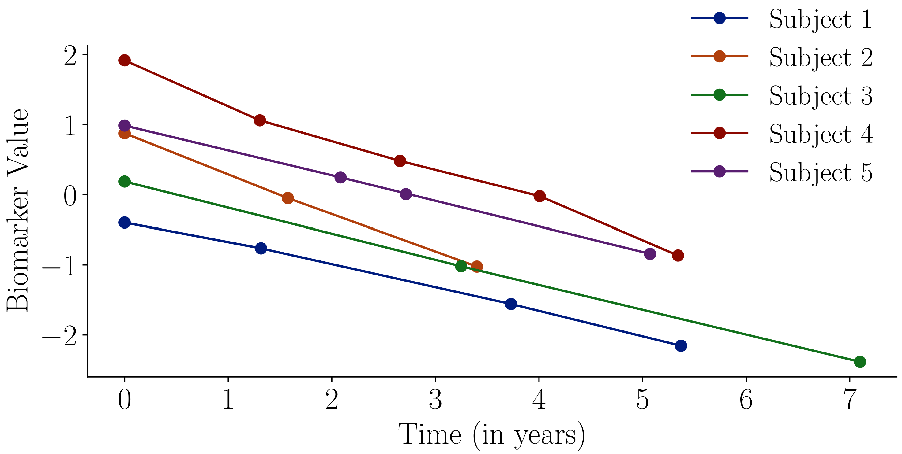

# Uncertainty-Calibrated Prediction of Randomly-Timed Biomarker Trajectories with Conformal Bands

[](https://neurips.cc/)
[](LICENSE)

This repository contains the implementation and experimental code for the paper **"Uncertainty-Calibrated Prediction of Randomly-Timed Biomarker Trajectories with Conformal Bands"** accepted at NeurIPS 2025.

## Authors

- **Vasiliki Tassopoulou**$^{1,*}$ 
- **Charis Stamouli**$^{2,*}$  
- **Haochang Shou**$^{3}$ 
- **George J. Pappas**$^{2}$
- **Christos Davatzikos**$^{1}$ 

$^{1}$ Center for AI and Data Science for Integrated Diagnostics (AI2D), Perelman School of Medicine, University of Pennsylvania, Philadelphia, PA 19104, USA  
$^{2}$ Department of Electrical and Systems Engineering, University of Pennsylvania  
$^{3}$ Department of Biostatistics, Epidemiology and Informatics, University of Pennsylvania  
$^{*}$ Equal contribution

## Overview

This work presents a novel approach for predicting biomarker trajectories with uncertainty quantification using conformal prediction. The method addresses the challenge of predicting biomarker evolution over time when measurement times are irregular and random.

### Example of irregular and randomly-timed biomarker trajectories for 5 subjects



## Key Features

- **Conformal Prediction**: Provides statistically valid uncertainty bands for biomarker trajectory predictions
- **Random Timing Handling**: Robust to irregular and randomly-timed biomarker measurements
- **Uncertainty Calibration**: Ensures prediction intervals maintain proper coverage guarantees
- **Biomarker Trajectory Modeling**: Specialized for longitudinal biomarker data analysis


## Installation

1. Clone the repository:
```bash
git clone https://github.com/yourusername/ConformalBiomarkerTrajectories.git
cd ConformalBiomarkerTrajectories
```

2. Create a virtual environment:
```bash
python -m venv venv
source venv/bin/activate  
```

3. Install dependencies:
```bash
pip install -r requirements.txt
```

## 📂 Repository Structure

```bash
ConformalBiomarkerTrajectories/
├── *.py                 # Core experiment and utility scripts
├── data/                # Input datasets, covariates, and fold splits
├── results/             # Model outputs and conformalized prediction results
├── figures/             # Generated figures and visualizations
├── requirements.txt     # Project dependencies
└── README.md            # Repository documentation
 

### Run Experiments

```bash
# Run main experiments
./conformal_experiments.sh 
```

## Data

The experiments in this repository use sample and anonymized longitudinal biomarker data. Due to privacy and data sharing restrictions, the actual datasets are not included in this repository as well as its covariates (Diagnosis, Sex, APOE4 Alleles and Education)

## Citation

If you use this code in your research, please cite our paper:

```bibtex
@inproceedings{tassopoulou2025uncertainty,
  title={Uncertainty-Calibrated Prediction of Randomly-Timed Biomarker Trajectories with Conformal Bands},
  author={Tassopoulou, Vasiliki and Stamouli, Charis and Shou, Haochang and Pappas, George J and Davatzikos, Christos},
  booktitle={Advances in Neural Information Processing Systems (NeurIPS)},
  year={2025}
}
```

## License

This project is licensed under the MIT License - see the [LICENSE](LICENSE) file for details.

## Contact

For questions about this work, please contact:
- Vasiliki Tassopoulou: tassopoulouvasiliki@gmail.com / vtass@seas.upenn.edu
- Charis Stamouli: xarisstml@gmail.com / stamouli@seas.upenn.edu

---

## System Specifications

**OS:** Ubuntu 18.04.6 LTS  
**Kernel:** 5.4.0-150-generic  
**CPU:** Intel Xeon Gold 6248R (24 cores / 96 threads)  
**RAM:** 754 GB  
**GPU:** 2× NVIDIA RTX A6000 (48 GB each, CUDA 12.4, Driver 550.78)  
**PyTorch:** 1.13.1+cu117 (CUDA 11.7)

### Key Dependencies

- **Python**: 3.8.20
- **PyTorch**: 1.12.1 (CPU version)
- **GPyTorch**: 1.10.0
- **NumPy**: 1.22.3
- **Pandas**: 1.2.3
- **SciPy**: 1.9.3
- **Scikit-learn**: 1.3.0

### Verification

Test your environment setup:

```bash
conda activate conformal-biomarker
python -c "import torch; print(f'PyTorch: {torch.__version__}')"
python -c "import gpytorch; print(f'GPyTorch: {gpytorch.__version__}')"
python -c "import numpy as np; print(f'NumPy: {np.__version__}')"
```
